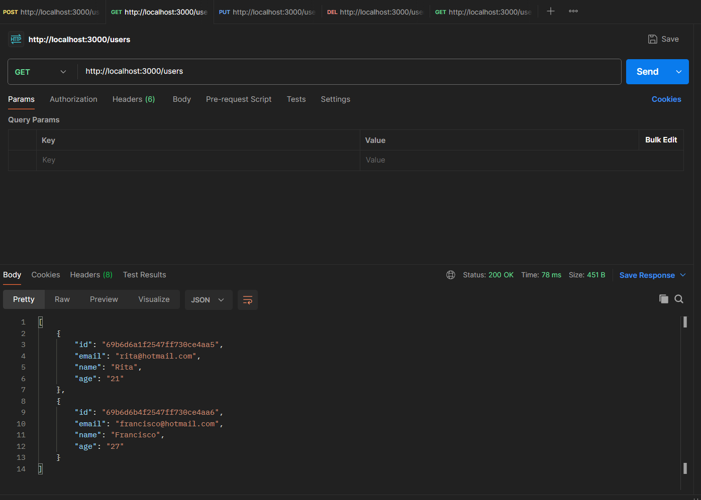
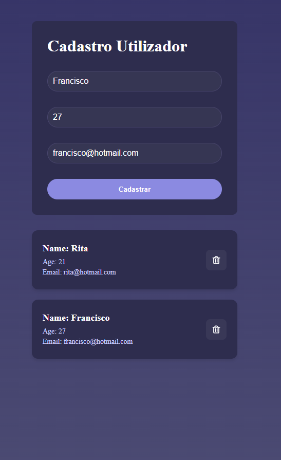

# 📝 Cadastro de Utilizadores (NodeJS | React | Prisma | MongoDB)

Projeto de **aplicação web fullstack** que permite **registar, listar e eliminar utilizadores** utilizando **NodeJS, MongoDB, Prisma e React**.  

O backend fornece uma **API REST** e o frontend consome esta API de forma interativa.

---

# 📂 Estrutura do Projeto

```text
APP_TUTORIAL_YT
│
├── BackEnd
│   ├── server.js
│   └── prisma
│       └── schema.prisma
│
├── FrontEnd
│   ├── src
│   │   ├── pages
│   │   │   └── Home/index.js
│   │   └── services
│   │       └── api.js
│   └── package.json
│
├── Images
│   ├── Postman_GET.png
│   └── React_APP.png
│
└── README.md
```

---

# 🛠 Tecnologias Utilizadas

* **Backend:** NodeJS, Express, Prisma v6.0.0, MongoDB, CORS  
* **Frontend:** React, Axios  
* **Banco de Dados:** MongoDB (via Prisma Client)  

---

# 🔗 Endpoints da API

| Método | Endpoint       | Descrição                              |
| ------ | -------------- | -------------------------------------- |
| GET    | /users         | Retorna todos os utilizadores ou filtra por query params (name, email, age) |
| POST   | /users         | Cria um novo utilizador                |
| PUT    | /users/:id     | Atualiza um utilizador existente       |
| DELETE | /users/:id     | Remove um utilizador pelo ID           |

---

### Exemplo de query params

```http
GET /users?name=Francisco&email=teste@email.com
Exemplos de Payload JSON

POST /users

{
  "name": "Francisco",
  "email": "francisco@email.com",
  "age": "25"
}

PUT /users/:id

{
  "name": "Francisco Atualizado",
  "email": "francisco_atualizado@email.com",
  "age": "26"
}

DELETE /users/:id

{
  "message": "Delete efetuado com sucesso"
}
```

---

🖼 Visualizações

Postman GET request:


---

Aplicação React final: 


---

⚙️ Configuração do Projeto
Clonar repositório
git clone https://github.com/FranciscoG08/NodeJS_React_Registo_Utilizadores.git
cd APP_TUTORIAL_YT
💻 Backend

Entrar na pasta do backend:

cd BackEnd

Instalar dependências:

npm install

Configurar variável de ambiente DATABASE_URL no .env para conectar ao MongoDB:

DATABASE_URL="sua_string_de_conexao_mongodb"

Rodar servidor:

node server.js

---

🌐 Frontend

Entrar na pasta do frontend:

cd FrontEnd

Instalar dependências:

npm install

Rodar aplicação React:

npm start

---

📋 Testes com Postman

GET /users → retorna todos os utilizadores ou filtrados por query params.

POST /users → cria um novo utilizador usando JSON no corpo da requisição.

PUT /users/:id → atualiza os dados de um utilizador existente.

DELETE /users/:id → remove um utilizador pelo ID.

---

👨‍💻 Autor

Francisco Guedes